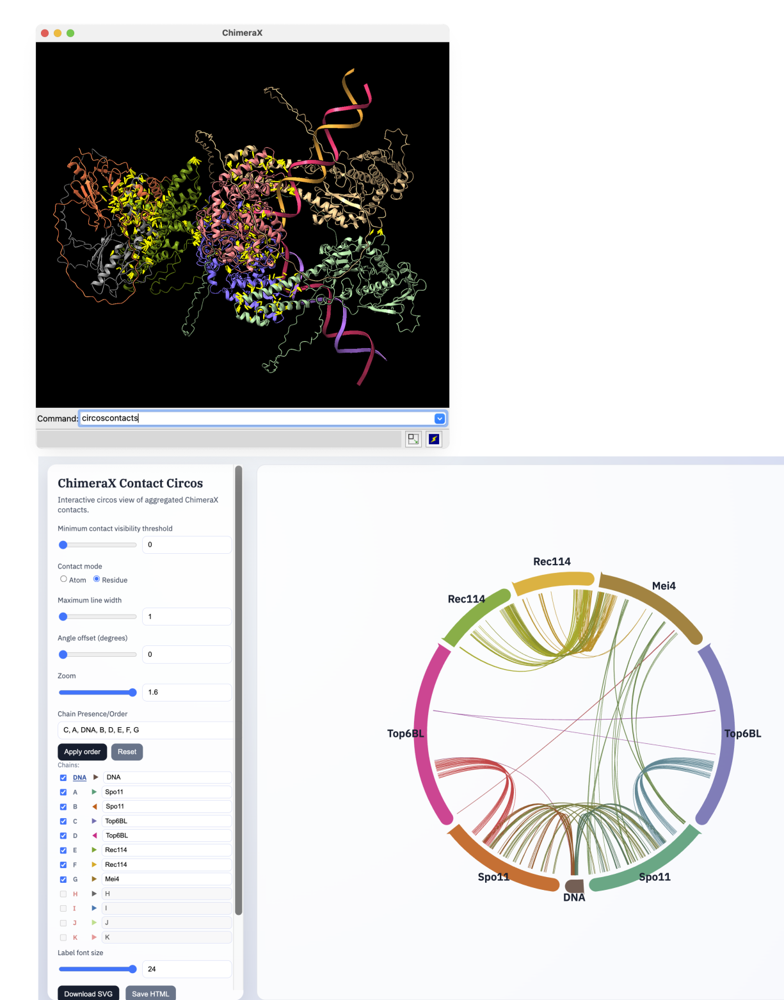

# ChimeraX CircosContacts

`circoscontacts` is a ChimeraX command plugin that:

- computes contacts from currently open structures (or a selected subset),
- aggregates contacts across models,
- writes an interactive circos-style HTML analysis view,
- exports publication graphics (`.svg`), session state (`.json`), and ChimeraX coloring scripts (`.cxc`).

This documentation focuses on practical use by ChimeraX users.



## Install

From ChimeraX command line:

```chimerax
toolshed install /path/to/chimerax_circoscontacts-0.4.11-py3-none-any.whl
```

For local development install:

```chimerax
devel install /path/to/tools/chimerax_circoscontacts
```

## Quick Start

1. Open one or more atomic models in ChimeraX.
2. Run:

```chimerax
circoscontacts
```

3. The plugin computes contacts (default protein-side source semantics), writes `contacts_circos.html`, and opens it in your default browser.
4. Use the web panel to filter, annotate, and export.

## What Gets Written

- `contacts_circos.html`: interactive viewer
- `contacts_circos.svg`: exported static figure (from **Download SVG**)
- `contacts_circos_colors.cxc`: color mapping back into ChimeraX
- `contacts_circos_session.json`: full interactive state

## Data Model Summary

- Each displayed chain is a circos “chromosome” arc.
- Protein and DNA are detected from residue types.
- DNA can be merged into one logical arc (including split/nicked double-stranded cases).
- Links are canonicalized (A↔B equals B↔A) and aggregated.
- Count display mode is switchable:
  - `Atom`: counts all atom-atom contact rows
  - `Residue`: counts each displayed contact arc at most once per model

See command details in [ChimeraX Command](chimerax-command.md) and UI behavior in [Web Interface](web-interface.md).
