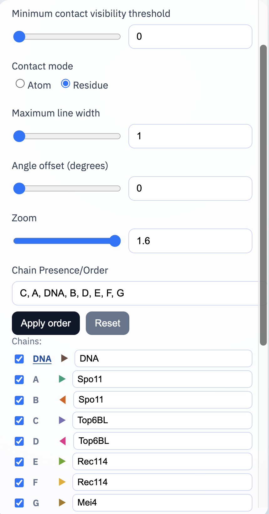
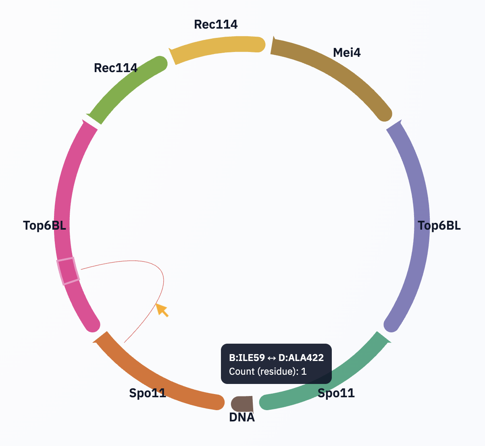
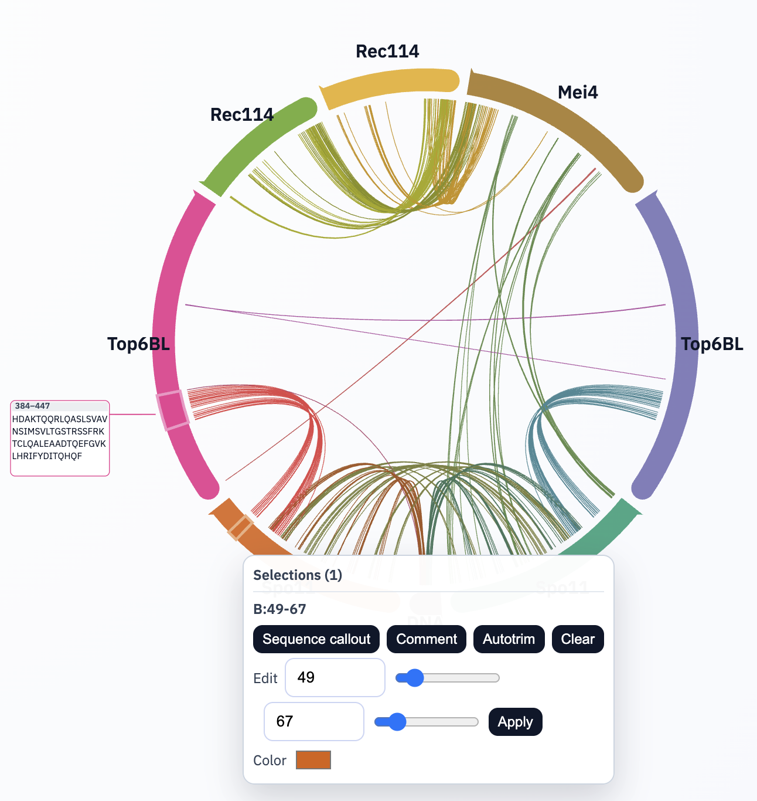

# Web Interface

The generated `contacts_circos.html` is the main analysis surface.

## Global Controls

### Minimum contact visibility threshold

- Slider + numeric box.
- Hides links with count `< threshold`.
- Applies to rendering, residue interactivity, and exports.

### Contact mode

- `Atom`: use atom-atom contact row counts.
- `Residue`: count each displayed contact arc at most once per model.
  This prevents merged double-stranded DNA arcs from overcounting when both nucleotides in a base pair contact the same protein residue in one model.

### Maximum line width

- Controls upper bound of contact arc stroke width.
- Width still scales by contact frequency.

### Angle offset (degrees)

- Rotates the layout manually.
- If a chain is bottom-locked, manual angle change clears the lock.

The plot auto-fits the available viewport. There is no manual zoom control.

### Chain Presence/Order

Text input defines displayed chain set and ordering.

- Comma- or space-separated chain IDs.
- Unknown chain IDs are reported as errors.
- Omitted chains are hidden from arcs and links.

## Per-chain Row Controls

Each available chain has a row with:

- Contact checkbox: toggles **only contact links** involving that chain.
- Original chain label (`DNA`, `A`, etc.): click to lock that chain midpoint to bottom.
- Direction arrow (`▶/◀`): flips arc orientation.
- Display-name field: editable label shown on arc.

### Bottom-lock behavior

Click the original chain label to lock its midpoint at the bottom of the circle.

Lock is removed when:

- another chain label is clicked,
- locked chain is removed from active order,
- angle is manually rotated.

### Display-name editing

- Type in the name field.
- Commit with `Enter` or `Tab`.
- `Tab` also advances focus to the next editable chain label and selects its text.
- Empty input restores the previous valid name.

## Interaction on the Plot

### Hover on chromosome arc

Shows tooltip with current chain/residue.

- Tooltip moves near cursor and clamps inside viewport.
- Tooltip background switches to blue when residue has visible links at current threshold (indicates shift-click isolate is available).

### Click-and-hold on chromosome arc

Temporarily show only links involving that chain.

- Release restores full visible set.

### Shift-click-and-hold on residue

Temporarily show only links involving that specific residue/base.

- Works from either endpoint of links.
- Release restores full visible set.

### Live residue position indicator

A minimal radial marker tracks hovered residue position along the arc.

## Region Selection and Annotation

Drag along a chromosome arc to create a selected region.

- Selection border is thick/light and includes target circles for menu activation.
- Overlapping selections are supported.

### Selection menu actions

- **Sequence callout**: creates sequence callout box for selection.
  - The selection menu stays open after clicking this.
  - Residues participating in at least one currently visible contact are emphasized in bold blue.
- **Comment**: creates editable free-text callout box.
- **Autotrim**: trims region to N/C-most linked residues within current threshold.
- **Edit**: numeric + slider start/end controls with validation.
- **Color**: recolors selected region overlay.
- **Clear**: remove selection metadata.

Disabled states are shown when actions would produce no result.

### Callout behavior

- Callout text is directly editable in place.
- Callouts are draggable.
- Callouts are resizable from corner handles.
- Callouts remain anchored to the originating selection by a connector line.
- Sequence callouts include range title (e.g., `55–80`) by default.
- Comment callouts use the same top drag bar as sequence callouts.
- Rich text emphasis (bold/italic) persists after blur.

## Export and Persistence

### Download SVG

Exports a static vector figure including:

- currently visible chains and links,
- region overlays,
- callouts and text.

SVG export converts editable HTML callout content to wrapped SVG text.

### Save HTML

Saves a standalone current-page HTML snapshot.

### ChimeraX Colors (`.cxc`)

Exports commands to:

1. color everything light gray,
2. recolor residues participating in visible links (>= threshold),
3. use link-matched colors on ribbons and surfaces.

Respecting current filters:

- threshold,
- visible chain set/order,
- per-chain contact checkbox state,
- count mode.

DNA coloring is strand-specific to the strand participating in each link.

### Save Session / Load Session (`.json`)

Persists full interactive state, including:

- controls (threshold, mode, widths, angle),
- chain states (visibility toggles, flips, display names),
- bottom-lock chain,
- selections, colors, callouts, and callout geometry.

Loading replaces current session state.
