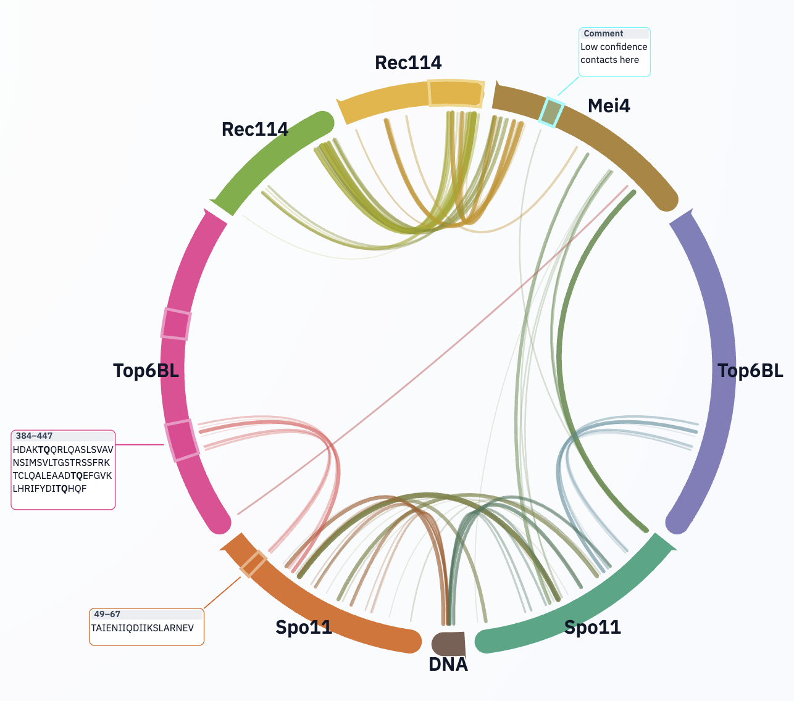

# Workflows

## Workflow A: Ensemble Contact Summary

Use when you have many related models and want conserved interaction patterns.

1. Open all relevant models in ChimeraX.
2. Run:

```chimerax
circoscontacts
```

3. In web UI:

- set `Contact mode` to `Residue` for residue-level persistence,
  where each displayed arc is counted at most once per model,
- raise threshold until sparse/noisy links fade,
- use chain presence/order to focus on biologically relevant components.

4. Export:

- `Download SVG` for figure draft,
- `Save Session` for reproducibility.

## Workflow B: Restricted Contact Query (contacts-like)

Use when analyzing contacts from a residue window against a specific target set.

```chimerax
circoscontacts #1,2/S,T:100-120 restrict /S,T/C interModel false intramol false
```

Then in web UI:

- keep full arcs visible to preserve context,
- inspect active region opacity to confirm source window,
- shift-click-hold residues to inspect endpoint-specific links.

## Workflow C: Annotated Figure Production

1. Set final chain ordering and optional bottom-lock chain.
2. Tune threshold and line-width scale.
3. Add region selections for domains/motifs.
4. Add sequence/comment callouts and adjust their positions.
5. Export SVG.

Tip: Save session before and after figure edits so annotation variants remain recoverable.



## Workflow D: Color Back in ChimeraX

After visual curation in the web UI:

1. Click **ChimeraX Colors**.
2. In ChimeraX, run:

```chimerax
open /path/to/contacts_circos_colors.cxc
```

3. Inspect link-correspondent colors on ribbon/surface.

This is useful for side-by-side presentation of structure and circos summary.

## Workflow E: Session-based Iterative Analysis

1. First pass: broad threshold, map candidate regions, save JSON.
2. Second pass: raise threshold, autotrim selections, refine callouts, save JSON.
3. Final pass: generate publication SVG + `.cxc`.

You can branch analyses by duplicating session files.
